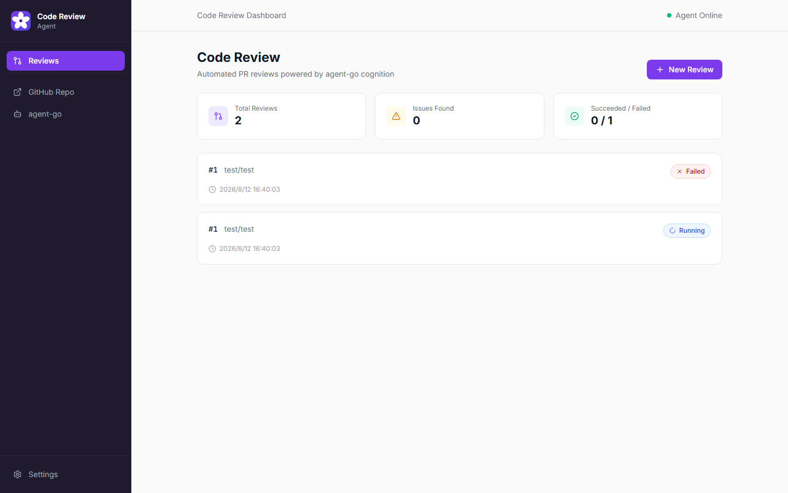
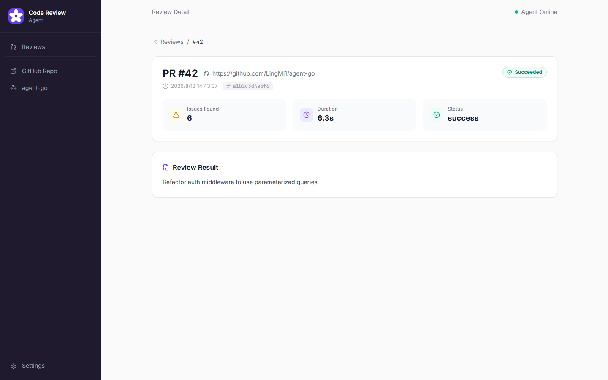

# Code Review Agent

[](https://github.com/LingMi1/code-review-agent/actions/workflows/ci.yml)
[](https://go.dev/)
[](https://www.typescriptlang.org/)
[](LICENSE)

> [English](README.md)

AI 代码审查工具，自动找出 PR 里的 bug、安全漏洞和性能问题。认知能力**完全由生产级多 Agent 平台 [agent-go](https://github.com/LingMi1/agent-go) 提供**，本仓库不内置任何 LLM SDK。

## 界面截图

| 审查列表 | 审查详情 |
|---|---|
|  |  |

## 工作原理

```
GitHub PR webhook / 手动触发
      │
      ▼
┌─────────────────────────────────┐
│ code-review-agent (Go)          │
│  • HMAC-SHA256 webhook 验签     │
│  • 拉取 PR diff                 │
│  • 按文件解析与分块             │
│  • 智能模型路由                 │
│  • 构造审查 prompt              │
└──────────┬──────────────────────┘
           │ gRPC (CognitionService.Run, server-streaming)
           ▼
┌─────────────────────────────────┐
│ agent-go 认知面 (Python)        │
│  • ReAct / Plan-Execute Agent   │
│  • 多 Agent 协作                │
│  • 输出结构化 JSON              │
└──────────┬──────────────────────┘
           │
           ▼
┌─────────────────────────────────┐
│ GitHub PR Review                 │
│  • 在代码行上内联评论            │
│  • 严重级：🔴 高 🟡 中 🟢 低     │
└─────────────────────────────────┘
```

## 功能特性

### 核心流程

- **真实 PR 处理**：处理 `opened`、`synchronize`、`reopened` 三类 PR 事件
- **HMAC-SHA256 Webhook 验签**：防止伪造请求
- **Diff 分块**：大 PR 按文件拆成 ≤800 行的块，逐块独立审查后合并
- **结构化 JSON 输出**：LLM 返回可被程序解析的审查结果（文件/行号/严重级/类别/建议）
- **优雅降级**：JSON 解析失败时回退为纯文本评论
- **GitHub API 限流处理**：遵循 `Retry-After` 响应头自动重试
- **去重**：基于 webhook delivery-id 去重，防止重复审查
- **生成文件过滤**：跳过 lockfile、protobuf stub、vendor 目录、二进制文件
- **审计日志**：每次审查操作带时间戳记录
- **由 agent-go 驱动**：本仓库不含任何 LLM SDK —— 认知能力全部通过 gRPC 交给 agent-go 完成

### 成本控制

- **模型路由**：`react` 模式 → agent-go `executor` 角色（默认 DeepSeek，便宜）；`plan_execute` 模式 → `planner` 角色（可通过 `COGNITION_PLANNER_MODEL` 切换到更强模型）
- **Prompt 截断**：prompt 上限 32KB，超长 hunk 在构造前裁剪

### 多 Agent（Plan-Execute）

复杂 PR（10+ 文件）使用 **plan-execute 模式**审查：Agent 先把审查任务拆解为独立子任务（安全、bug 检测、性能、代码质量），并行执行后汇总为一份结构化审查。

### 可观测性

- **OpenTelemetry**：真正的 OTel Go SDK + OTLP gRPC exporter，通过 W3C TraceContext（`otelgrpc` + `otelhttp`）实现 HTTP → gRPC 链路追踪
- **追踪配置**：设置 `OTEL_EXPORTER_OTLP_ENDPOINT` 将 trace 发送到 collector（如 Jaeger/Tempo）；未设置时本地采样但不导出
- **端到端追踪**：在 agent-go 认知面同样开启 OTel（`COGNITION_OTEL_ENABLED=true` + `COGNITION_OTEL_EXPORTER_OTLP_ENDPOINT` 指向同一 collector），即可把 Go 与 Python 两段 span 串进同一条 trace
- **`X-Trace-ID`**：每个响应都携带 trace ID 头，用于关联日志与 trace
- **Prometheus**：`/metrics` 端点对外提供审查数量、延迟、错误率
- **结构化日志**：`log/slog` 带 `trace_id` / `span_id` 字段

### 前端界面

- **React + TypeScript + Vite**：审查列表页和详情页
- **SSE 实时流**：通过 `/api/reviews/stream` 实时展示 Agent 思考过程
- **手动触发**：无需 webhook，直接在 UI 上对任意 PR 触发审查

### 评估体系

- **18 个标注 PR 测试用例**：覆盖安全、bug、性能、风格四类，含多 bug 与干扰项用例
- **Precision / Recall / F1 指标**：自动化评估运行器衡量 Agent 质量
- 真实数据见下方 [评估](#评估)

## 快速开始

### 前置条件

- Go 1.25+
- Docker（用于 agent-go 认知面）
- 具备 `repo` 权限的 GitHub Personal Access Token
- LLM API key（DeepSeek 或 Anthropic）

### 1. 克隆与设置

```bash
git clone https://github.com/LingMi1/code-review-agent.git
cd code-review-agent

# agent-go 需位于 ../agent-go/agent-go（go.mod replace）
# 如位置不同，调整 go.mod 中的 replace 指令
```

### 2. 配置环境

```bash
cp .env.example .env
# 编辑 .env 填入你的 token
```

### 3. 启动 agent-go 认知面

```bash
docker compose up -d cognition
```

### 4. 启动服务

```bash
export GITHUB_TOKEN=ghp_xxxx
export WEBHOOK_SECRET=mysecret
export COGNITION_ADDR=localhost:50051

go run ./cmd/server/
```

### 5. 启动前端（可选）

```bash
cd web
npm install
npm run dev
# 面板地址 http://localhost:5173（代理到 :8080）
```

### 6. 用 ngrok 暴露公网（本地开发）

```bash
ngrok http 8080
```

### 7. 配置 GitHub Webhook

1. 进入你的仓库 → Settings → Webhooks → Add webhook
2. Payload URL：`https://xxxx.ngrok.io/webhook`
3. Content type：`application/json`
4. Secret：与 `WEBHOOK_SECRET` 一致
5. Events：选择 "Pull requests"

### 8. 测试

向你的仓库提一个 PR，Agent 会在 30-60 秒内发布审查评论。也可以直接在面板 UI 上手动触发审查。

## 架构

```
code-review-agent/
├── cmd/
│   ├── server/main.go          # HTTP 服务入口
│   └── eval/main.go            # 评估运行器（--real 使用真实 LLM）
├── internal/
│   ├── webhook/                # GitHub webhook：HMAC 验签 + 去重
│   ├── github/                 # GitHub API：拉取 diff、发布审查
│   ├── diff/                   # Unified diff 解析器 + 分块 + 过滤
│   ├── prompt/                 # 审查 prompt 构造（react / plan-execute）
│   ├── cognition/              # gRPC 客户端 → agent-go 认知面
│   ├── review/                 # JSON 解析 → GitHub 审查发布
│   ├── store/                  # SQLite：审查历史 + 审计日志
│   ├── otel/                   # OpenTelemetry 追踪
│   ├── metrics/                # Prometheus /metrics 端点
│   ├── middleware/             # HTTP 中间件（OTel 埋点）
│   └── sse/                    # SSE 广播中心（实时 Agent 流）
├── eval/                       # 评估框架
│   ├── corpus/                 # 18 个标注测试 PR
│   ├── expected/               # 每个用例的期望问题
│   ├── runner.go               # Precision/Recall/F1 计算
│   └── reviewer_cognition.go   # 真实 agent-go 认知面审查器
├── web/                        # React + TypeScript + Vite 前端
├── assets/                     # README 使用的截图
├── docker-compose.yml          # cognition + app
├── Dockerfile                  # 多阶段 Go 构建
└── go.mod                      # replace → ../agent-go/agent-go/control-plane
```

## gRPC 集成

本项目通过 agent-go 认知面的公开 RPC `CognitionService.Run`（server-streaming）获取认知能力：

```go
// 来自 internal/cognition/client.go
stream, err := svc.Run(ctx, &agentv1.RunRequest{
    RunId:     uuid.New().String(),
    SessionId: fmt.Sprintf("pr-review-%d", prNumber),
    Query:     reviewPrompt,
    AgentType: "react",   // 大 PR 使用 "plan_execute"
    MaxSteps:  5,
})
// 收集事件...
```

本仓库不含 LLM SDK、prompt 模板、工具定义。agent-go 负责整个 Agent 循环。

## 评估

评估框架基于 18 个标注用例衡量 Agent 质量。每个用例包含一段带一个或多个已知问题的 diff（SQL 注入、竞态条件、XSS、空指针解引用等）和对应的问题标注。最后三个用例（016–018）刻意加难：单个 diff 内含多个 bug 并混入干扰项，避免“一个显眼 bug 就拉满 Recall”的注水现象。

使用 mock 审查器（基准）或真实 agent-go 认知面运行：

```bash
# Mock 基准（基于规则，无 LLM）
go run ./cmd/eval/

# 真实 agent-go 认知面（DeepSeek via gRPC）
go run ./cmd/eval/ -real
```

### 结果（DeepSeek-chat）

| 指标 | Mock 基准（18 用例） | DeepSeek（15 用例运行） |
|---|---|---|
| 通过率（F1 ≥ 0.5） | 56%（10/18） | **73%（11/15）** |
| Macro Precision | 0.49 | **0.51** |
| Macro Recall | 0.56 | **1.00** |
| Macro F1 | 0.52 | **0.68** |

> 真实 LLM 一列为在最初 15 个用例上最近一次 `-real` 运行的结果。针对 agent-go 认知面重跑 `go run ./cmd/eval/ -real` 即可刷新到全部 18 个用例。

关键发现：

- **Recall 1.00**：真实 LLM 找出了所有标注的 bug 和安全漏洞（零漏报）—— 这对代码审查工具是最重要的指标。
- **Precision 0.51**：Agent 还会报告标注集之外的额外发现（如废弃 API、缺少错误上下文）。其中很多是真实但不在人工标注范围内的问题，在严格匹配规则下降低了 precision。
- **多 bug 用例**：016–018 每个 diff 内含多个真实缺陷；mock 基准（基于规则）能全部命中，真实 LLM 则需在命中缺陷的同时避开干扰项。

## 审查格式

Agent 返回结构化 JSON：

```json
{
  "summary": "Added user authentication middleware with session management",
  "issues": [
    {
      "file": "src/auth/middleware.go",
      "line": 42,
      "severity": "high",
      "category": "security",
      "title": "SQL injection in user query",
      "description": "User input is concatenated directly into SQL string...",
      "suggestion": "Use parameterized query: db.Query('SELECT * FROM users WHERE id = $1', userID)"
    }
  ]
}
```

## API

| 端点 | 方法 | 说明 |
|---|---|---|
| `/webhook` | POST | GitHub webhook 接收（HMAC 验签） |
| `/health` | GET | 健康检查 |
| `/metrics` | GET | Prometheus 指标 |
| `/api/reviews` | GET | 列出最近审查 |
| `/api/reviews` | POST | 手动触发审查（owner/repo/pr_number） |
| `/api/reviews/:id` | GET | 获取审查详情 |
| `/api/reviews/stream` | GET | 审查事件的 SSE 流 |

## 技术栈

| 层 | 技术 |
|---|---|
| 后端 | Go 1.25、net/http |
| Agent 引擎 | **agent-go**（Python/LangGraph via gRPC） |
| 前端 | React 18、TypeScript、Vite、Tailwind CSS |
| 存储 | SQLite（本地）、PostgreSQL（via agent-go） |
| 可观测性 | OpenTelemetry、Prometheus、`log/slog` |
| 部署 | Docker、Docker Compose |
| LLM | DeepSeek / Claude（via agent-go） |

## License

MIT
